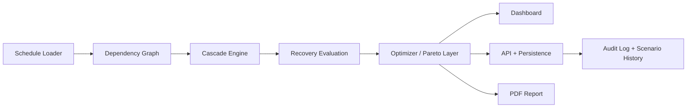

# SILSILA

SILSILA is an airline-operations simulation platform for analyzing how inbound delays propagate through a hub-and-spoke network and how different recovery actions change the outcome. The current implementation is modeled around Hamad International Airport (`DOH/OTHH`) and combines disruption propagation, recovery tradeoff analysis, operator workflow, risk simulation, and reporting in a single system.

## Overview

The system starts from a daily flight schedule, constructs a dependency graph across flights, then answers a practical operational question:

> If this inbound flight is delayed, which downstream legs are affected, how severe is the cascade, and what is the best recovery action under the current assumptions?

SILSILA models three disruption channels:

- aircraft rotation dependencies
- simplified crew dependencies
- passenger connection dependencies

It then evaluates three recovery classes:

- `SWAP`
- `DELAY`
- `CANCEL`

The output is surfaced through an operator-facing dashboard, a backend service/API layer, persistent scenario history, audit logs, and exportable reporting.

## Core Capabilities

- Directed dependency graph construction over a daily hub schedule
- Multi-hop disruption propagation with cost, passenger, and severity metrics
- Recovery evaluation across multiple candidate actions
- Discrete optimization and Pareto-tradeoff labeling for recovery options
- Monte Carlo network-risk analysis
- Turnaround sensitivity analysis
- Persistent scenarios, workflow state, and audit trail
- PDF export and deployment-ready runtime configuration

## System Flow



## Architecture

### Simulation Engine

The `engine/` package contains the domain logic:

- graph construction
- cascade propagation
- recovery modeling
- optimization
- Monte Carlo analysis
- sensitivity analysis
- report generation
- validation and benchmarking

Key files:

- [`engine/graph_builder.py`](engine/graph_builder.py)
- [`engine/cascade.py`](engine/cascade.py)
- [`engine/recovery.py`](engine/recovery.py)
- [`engine/optimizer.py`](engine/optimizer.py)
- [`engine/monte_carlo.py`](engine/monte_carlo.py)
- [`engine/sensitivity.py`](engine/sensitivity.py)
- [`engine/pdf_report.py`](engine/pdf_report.py)

### Application Layer

The `ui/` package provides the operator console:

- trigger-flight selection
- delay controls
- network visualization
- event feed
- recovery decision cards
- workflow-state controls
- Monte Carlo and sensitivity panels
- export actions

Key files:

- [`ui/layout.py`](ui/layout.py)
- [`ui/callbacks_core.py`](ui/callbacks_core.py)
- [`ui/callbacks_phase3.py`](ui/callbacks_phase3.py)
- [`ui/dashboard_views.py`](ui/dashboard_views.py)

### Backend And Operations Layer

The `ops/` package provides the platform services behind the UI:

- scenario persistence
- audit logging
- workflow transitions
- background jobs
- health and metrics endpoints
- runtime status and confidence reporting

Key files:

- [`ops/services.py`](ops/services.py)
- [`ops/api.py`](ops/api.py)
- [`ops/repository.py`](ops/repository.py)
- [`ops/jobs.py`](ops/jobs.py)
- [`ops/observability.py`](ops/observability.py)

## Repository Layout

```text
engine/   Simulation, graph, recovery, optimizer, analysis, reporting
ui/       Dash layout, callbacks, view builders, session-state helpers
ops/      API, services, persistence, auth, jobs, observability
tests/    Regression, workflow, ingestion, deployment, browser-smoke tests
docs/     Requirements, validation, UI spec, calibration, deployment notes
```

## Data Model

SILSILA supports two runtime data modes:

- public/hybrid schedule construction using OpenSky arrivals where available
- synthetic fallback schedule generation for deterministic local use and degraded-mode operation

Schedule provenance is carried through the runtime and exposed in the application state, health endpoints, and UI.

## Running Locally

### Windows PowerShell

```powershell
python -m venv venv
.\venv\Scripts\Activate.ps1
pip install -r requirements.txt
python app.py
```

### macOS / Linux

```bash
python -m venv venv
source venv/bin/activate
pip install -r requirements.txt
python app.py
```

Open `http://localhost:8050`.

## Verification

Run the full regression suite:

```bash
python -m pytest -q
```

The test suite covers:

- schedule schema and provenance
- graph construction and dependency integrity
- cascade propagation behavior
- recovery and optimizer regressions
- callback and workflow-state transitions
- ingestion fallback and runtime health behavior
- deployment entrypoint and configuration checks
- browser-level smoke coverage where supported by the environment

Representative files:

- [`tests/test_smoke.py`](tests/test_smoke.py)
- [`tests/test_ops_platform.py`](tests/test_ops_platform.py)
- [`tests/test_dash_workflow_callbacks.py`](tests/test_dash_workflow_callbacks.py)
- [`tests/test_ingestion_reliability.py`](tests/test_ingestion_reliability.py)
- [`tests/test_deployment_config.py`](tests/test_deployment_config.py)

## Deployment

The repository is configured for deployment on Render.

Deployment assets:

- [`render.yaml`](render.yaml)
- [`Procfile`](Procfile)
- [`runtime.txt`](runtime.txt)
- [`gunicorn.conf.py`](gunicorn.conf.py)
- [`server.py`](server.py)

Current deployment model:

- single web service
- Gunicorn application server
- persistent disk mounted at `/var/data`
- SQLite runtime database at `/var/data/silsila_ops.db`
- health probe at `/healthz`

Entry point:

```bash
gunicorn server:server --config gunicorn.conf.py
```

Additional deployment notes:

- [`docs/deployment.md`](docs/deployment.md)
- [`docs/ops_runbook.md`](docs/ops_runbook.md)

## Documentation

Supporting engineering documentation lives under [`docs/`](docs/):

- [`docs/requirements.md`](docs/requirements.md)
- [`docs/functional_decomposition.md`](docs/functional_decomposition.md)
- [`docs/data_dictionary.md`](docs/data_dictionary.md)
- [`docs/ui_spec.md`](docs/ui_spec.md)
- [`docs/fmea.md`](docs/fmea.md)
- [`docs/verification_validation.md`](docs/verification_validation.md)
- [`docs/historical_validation.md`](docs/historical_validation.md)
- [`docs/cost_calibration.md`](docs/cost_calibration.md)

## Technical Scope

This repository is best understood as a systems-engineering and decision-support platform. It is designed to be inspectable, testable, and deployable, with explicit modeling assumptions and a clear separation between simulation, UI, and platform services.

It is not positioned as an airline-certified production optimizer or a full network-wide operations research stack. The current architecture is optimized for clarity, simulation fidelity under explicit assumptions, and operator-facing usability.
